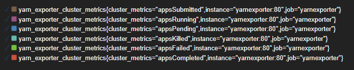
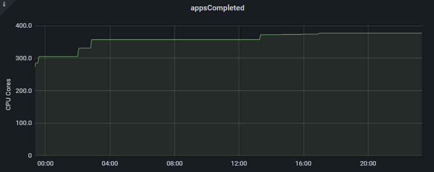

# Yarn_exporter for jupyterhub

Yarn exporter. Relevant for organizing the collection of YARN metrics from the Openshift cluster



## Setting build

Requirements:

``prometheus-client==0.14.1``
``requests-kerberos==0.14.0``
``yarn-api-client==1.0.3``

Build

```bash
python3 setup.py sdist bdist_wheel
```
output: 
```
creating 'dist\yarn_exporter-0.0.1-py3-none-any.whl
```
# Exporter parameters
```bash
export POLLING_INTERVAL_SECONDS=180
export EXPORTER_PORT=2517
```

# Hadoop YARN Entrypoint
```bash
export YARN_SCHEME="http"
export YARN_HOST="0.0.0.0"
export YARN_PORT="8088"
```

# Helm command
```bash
helm upgrade --install yarnexporter .
```

# Prometheus config
```config
- job_name: 'yarnexporter'
  metrics_path: '/'
  static_configs:
  - targets: ['yarnexporter']
```

## Metrics

| Metrics             | From hadoop yarn                                                                                               |
|---------------------|----------------------------------------------------------------------------------------------------------------|
| `yarn_exporter_app` | appsCompleted<br/>appsSubmitted<br/>appsSubmitted<br/>appsFailed<br/>appsRunning<br/>appsPending<br/>appsKilled |
| `yarn_exporter_app_info`  | applicationID<br/>applicationType<br/>name<br/>user                                                            |
| `yarn_exporter_app`  | allocatedVCores<br/>allocatedMB<br/>runningContainers                                                                    |


## License

MIT © Richard McRichface